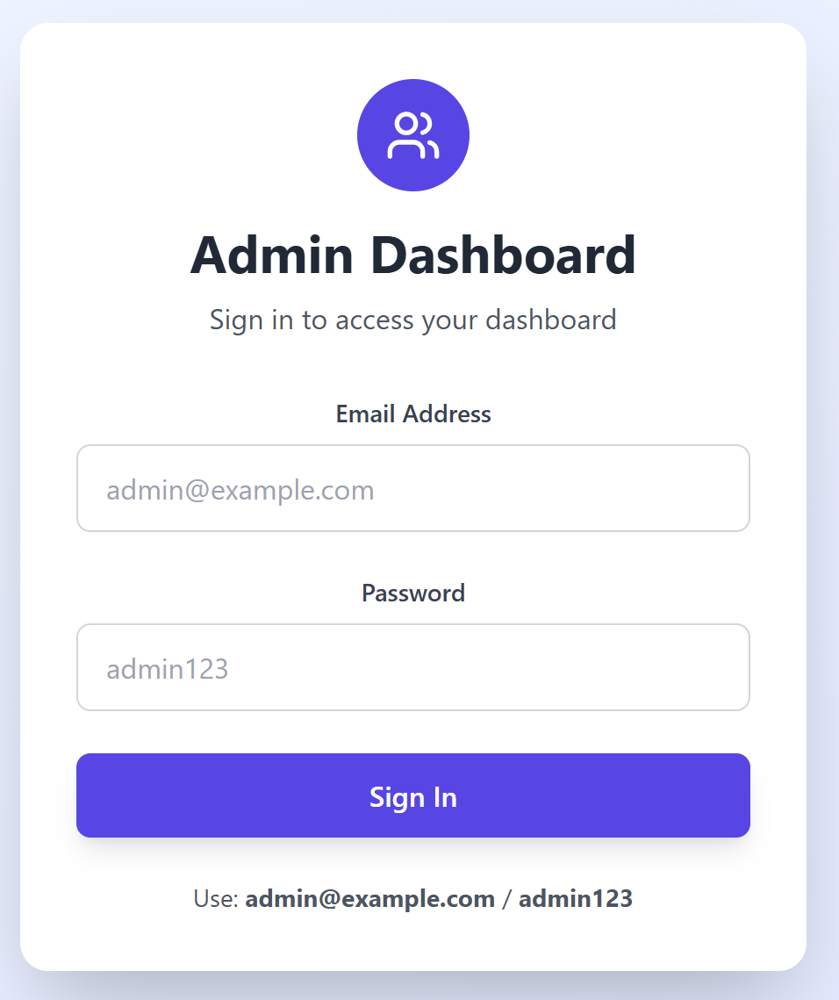
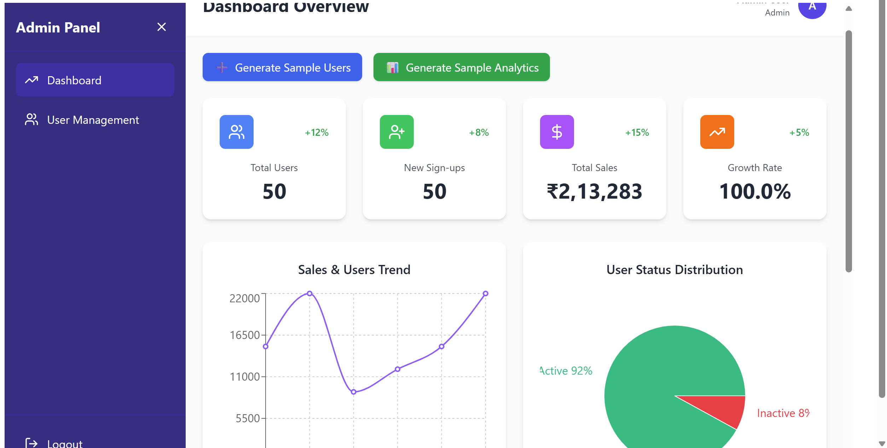
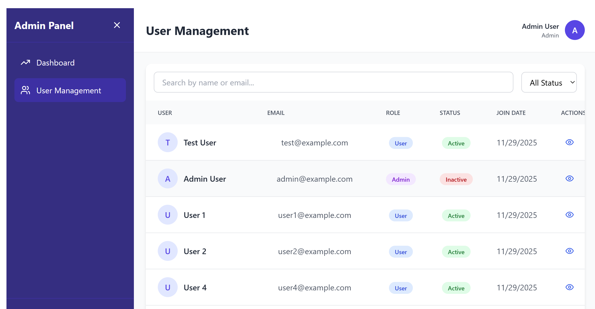
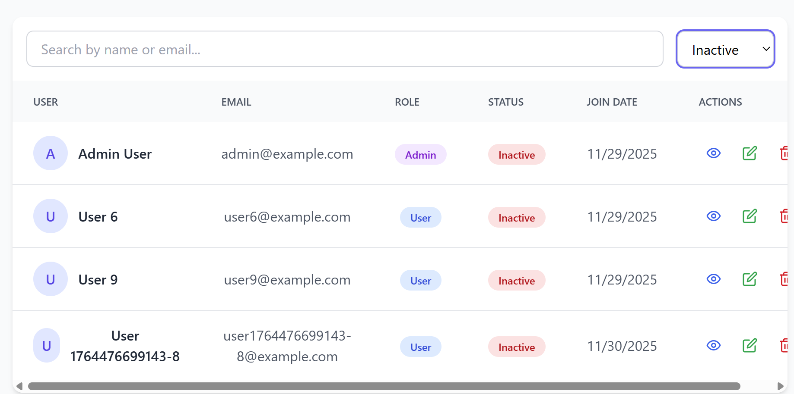

# Admin Dashboard with Analytics & Reporting

This project is a full-stack admin dashboard built using the MEAN stack (MongoDB, Express.js, Angular, Node.js). It includes secure authentication, user role management, and interactive analytics visualizations such as charts, metrics, and user insights. The backend and frontend are structured separately within the same project.

---

## Features

### Admin Authentication
Secure JWT-based login system that restricts dashboard access to authenticated admins.

### User Management
- View all users  
- Delete users  
- Activate or deactivate user accounts  
- View roles, email, and join date  

### Dashboard Analytics
- Sales trend visualization  
- User sign-up growth  
- Revenue analytics  
- User distribution (Pie chart)  

### Data Seeding
Generate:
- Sample users  
- Sample analytics data  
Useful for demos without manually inserting database entries.

### Responsive UI
The dashboard adjusts smoothly across desktops, tablets, and mobile screens.  
Sidebar navigation remains fixed while content scrolls independently.

---

## Tech Stack

### Frontend
- React.js (Vite)  
- Axios  
- Recharts  
- Tailwind CSS  
- Lucide Icons  

### Backend
- Node.js  
- Express.js  
- MongoDB + Mongoose  
- JSON Web Tokens (JWT)  
- Bcrypt  

---

## Project Structure

```
admin-dashboard/
  backend/
    models/
    middleware/
    routes/
    server.js
    package.json
    .env.example

  frontend/
    public/
    src/
      services/
      components/
      AdminDashboard.jsx
      App.jsx
      main.jsx
    package.json
    .env.example

  README.md
```

---

## Setup Instructions (Local Development)

### 1. Clone the Repository

```
git clone https://github.com/yourusername/admin-dashboard.git
cd admin-dashboard
```

---

## 2. Backend Setup

Install dependencies:

```
cd backend
npm install
```

Create a `.env` file (based on `.env.example`):

```
PORT=5000
MONGODB_URI=your_mongodb_connection_string
JWT_SECRET=your_jwt_secret
```

Start the backend:

```
npm start
```

Backend runs at:

```
http://localhost:5000
```

### Seed Database (Required Before Login)

Open this URL in a browser:

```
http://localhost:5000/api/seed
```

Default admin created:

- Email: admin@example.com  
- Password: admin123

---

## 3. Frontend Setup

Open a new terminal and install dependencies:

```
cd frontend
npm install
```

Optional `.env`:

```
VITE_API_URL=http://localhost:5000
```

Start the frontend:

```
npm run dev
```

Frontend runs at:

```
http://localhost:5173
```

---

## Notes

- Login is required to access the dashboard.  
- Token is stored in browser localStorage.  
- Buttons available to generate sample users and analytics.  
- If MongoDB is cleared, run `/api/seed` again.  

---

## Drawbacks / Limitations

- Only admin login available (no signup).  
- Exporting and advanced filtering not implemented yet.  

---

## Real-World Relevance

This structure and functionality reflect what is commonly used in CRM dashboards, analytics panels, e-commerce admin tools, and SaaS dashboards. It covers key concepts such as authentication, role-based access control, CRUD operations, and data visualization.

---

## Project Outputs 
### 🔹 Login Page


### 🔹 Dashboard View



## user mangemnet 




## License

This project is developed for academic and learning purposes.
